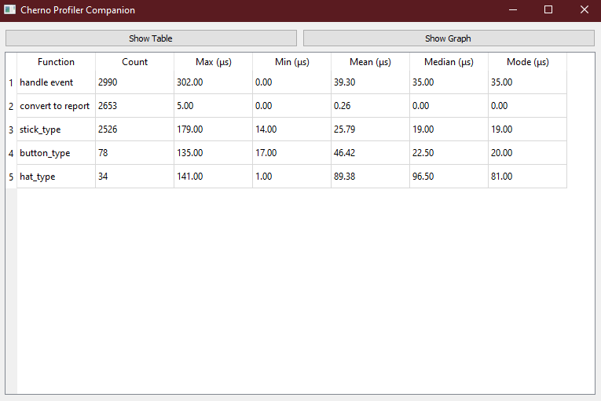
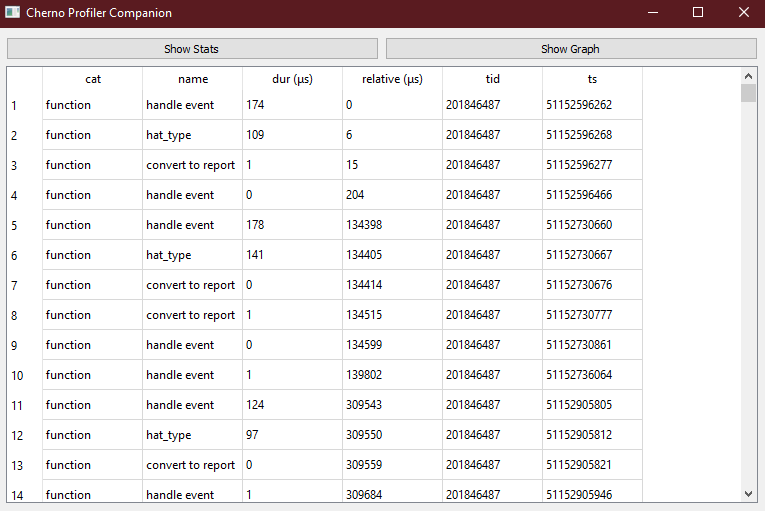
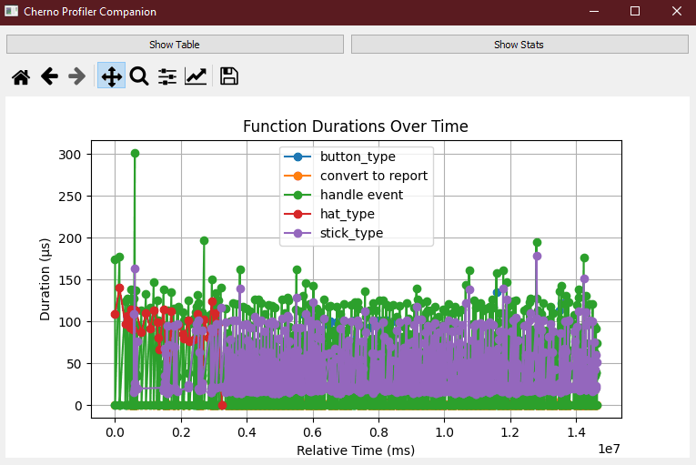

# Cherno Profiler Companion
Forget about Chrome and, ...Firefox. Bring your Profiling JSON data back home to Python.
Built as a visual companion to [TheCherno Instrumentor](https://gist.github.com/TheCherno/31f135eea6ee729ab5f26a6908eb3a5e).

## Usage

#### Install Requirements
```
pip install -r requirements.txt
```
#### Type
```
python show_profile.py results.json
```

#### Observe
##### Stats

##### Table

##### Graphs
